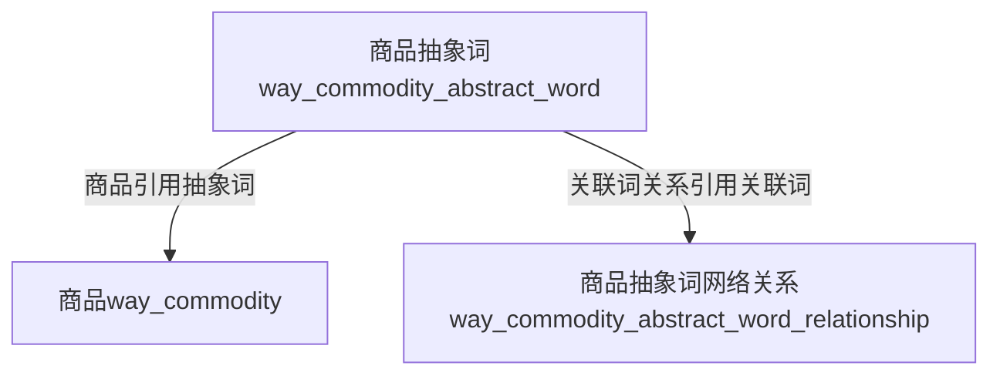

> 抽象词，从结构上来看，跟传统的商品分类相似，没什么区别。

## 商品、抽象词、抽象词关联之间的关系


### 具体实例

#### 假设抽象词的结构

- 手机
  - 苹果手机（C1）
  - 苹果手机配件（C2）
  - 安卓手机
- 家用电器
  - 家用电器配件
    - 插线板（C3)
    - 延长线（C4）
    - 电源线（C5）

#### 对商品、抽象词和抽象词关联关系的具体讲解

> 只有叶子节点才能进行抽象词关联

| 商品          | 抽象词                     | 抽象词解释                                     | 抽象词关联 | 抽象关联词解释                                               |
| ------------- | -------------------------- | ---------------------------------------------- | ---------- | ------------------------------------------------------------ |
| iPhone XS Max | 苹果手机（C1）             | 代表将商品进行抽象，无论什么型号，都是苹果手机 | C2         | 抽象词C1，在对应商品进行展示的时候，会有抽象词C2对应的商品列表进行展示。 |
|               |                            |                                                |            |                                                              |
| iPhone 充电线 | 苹果手机配件（C2）         |                                                | C3         | 抽象词C2，在对应商品进行展示的时候，会有抽象词C3对应的商品列表进行展示。 |
|               |                            |                                                |            |                                                              |
| iPhone 电源头 | 苹果手机配件（C2）         |                                                | C3         | 抽象词C2，在对应商品进行展示的时候，会有抽象词C3对应的商品列表进行展示。 |
|               |                            |                                                |            |                                                              |
| 公牛插线板    | 插线板（C3）、延长线（C4） | 一款商品，目前可以有最多**5**个，抽象词        |            |                                                              |
|               |                            |                                                |            |                                                              |
| 台式机电源线  | 电源线（C5）               |                                                | C4         | 抽象词C5，在对应商品进行展示的时候，会有抽象词C4对应的商品列表进行展示。 |

#### 商品、抽象词和抽象词关联关系，具体结构的真实展示

*拿C1和C2之间的关系做个真实的展示示例*

```html
<!doctype html>
<html>
  <head>
    <title>iPhone XS Max - 商品详情</title>
  </head>
  <body>
    <!-- 商品基本信息 -->
    <table>
      <tr>
        <td>这里展示商品图片</td>
      </tr>
      <tr>
      	<td>iPhone XS Max 玫瑰金 128G</td>
      </tr>
      <tr>
      	<td>¥5888</td>
      </tr>
    </table>
    <!-- 抽象关联词，展示列表 -->
    <table>
      <tr>
      	<td>商品图片</td>
        <td>iPhone 充电线</td>
        <td>¥18</td>
      </tr>
      <tr>
      	<td>商品图片</td>
        <td>iPhone 电源头</td>
        <td>¥9.9</td>
      </tr>
      <tr>
      	<td>商品图片</td>
        <td>iPhone 充电线</td>
        <td>¥18</td>
      </tr>
      <tr>
      	<td>商品图片</td>
        <td>iPhone 充电线</td>
        <td>¥18</td>
      </tr>
      <tr>
      	<td>商品图片</td>
        <td>iPhone 电源头</td>
        <td>¥9.9</td>
      </tr>
    </table>
  </body>
</html>
```

## 商品和抽象词之间的限制

* 商品只能关联抽象词的叶子节点
* 商品可以关联最多**5**个抽象词